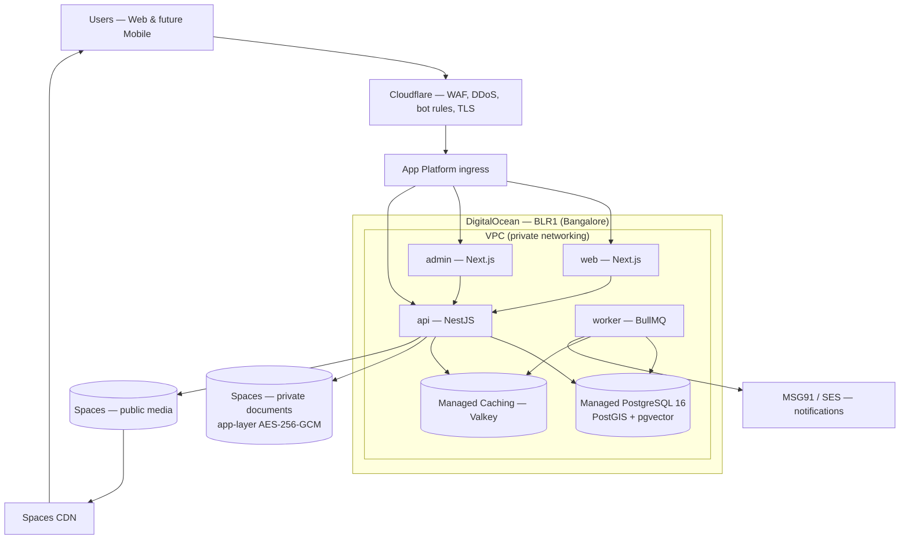
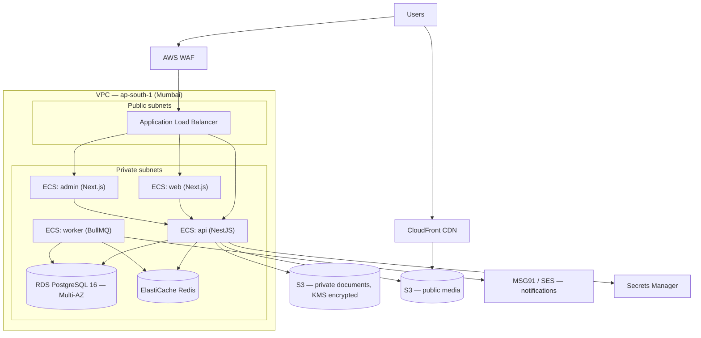

# Deployment Strategy

**Project:** Kamala Infra Digital Property Platform
**Companion document:** [ARCHITECTURE.md](ARCHITECTURE.md)
**Status:** Proposed — pending sign-off
**Last updated:** 2026-07-27

---

## 1. How platforms like this are actually deployed

A verified-listing property marketplace serving Indian users has four characteristics that shape every hosting decision:

1. **Users are in India.** Latency and, more importantly, data residency expectations point to an Indian region. AWS Mumbai (`ap-south-1`), Azure Central India, and GCP Mumbai (`asia-south1`) are the realistic options. AWS Mumbai has the deepest managed-service catalogue and the largest local talent pool.
2. **The platform holds government identity documents.** Aadhaar and ownership deeds demand encryption at rest with customer-managed keys, tight IAM, and a complete access audit trail — capabilities that favour a full cloud provider over a simplified application host.
3. **Public listing pages must be crawlable and fast.** Organic search is a primary acquisition channel for property marketplaces. This means server-rendered pages plus a CDN in front of images.
4. **Listing data attracts scrapers.** Property marketplaces are scraped aggressively by competitors. A WAF with bot and rate-limit rules is standard practice from launch, not a later hardening step.

The industry-standard shape that follows from these constraints is: **containerised services on a managed orchestrator, behind a load balancer and WAF, with managed PostgreSQL, managed Redis, and object storage fronted by a CDN — all inside an Indian cloud region, deployed from CI with infrastructure defined as code.**

---

## 2. Environments

Three isolated environments, each a separate cloud account or project, with no shared credentials or data.

| Environment | Purpose | Data | Access |
|---|---|---|---|
| **Development** | Local work | Seeded synthetic data only | Developers |
| **Staging** | QA, UAT, demos | Synthetic data mirroring production shape | Team + stakeholders, IP-restricted |
| **Production** | Live pilot | Real user data | Deploys via CI only; no direct human write access |

**Rules.** Staging mirrors production topology, at smaller instance sizes — a bug that only appears because staging is architecturally different is a bug found by customers. Real production data is **never** copied to staging; if realistic data is needed, it is generated or irreversibly anonymised. Nobody deploys to production from a laptop.

---

## 3. Hosting options compared

### Option A — DigitalOcean (Bangalore) + Cloudflare ⭐ *recommended*

| Component | Service |
|---|---|
| Compute | App Platform — separate components for `web`, `admin`, `api`, `worker` |
| Database | Managed PostgreSQL 16 (BLR1) |
| Cache / queues | Managed Caching (Valkey, Redis-compatible) |
| Object storage | Spaces — separate public-media and private-documents buckets |
| CDN | Spaces CDN (included) |
| Edge / WAF / DDoS | Cloudflare in front of the load balancer |
| Registry | DigitalOcean Container Registry |
| Secrets | App Platform encrypted variables, or Infisical / Doppler |
| Document encryption | **Application-level (AES-256-GCM)** — see §3.5 |

**Estimated cost:** ~$100–135 / month at pilot volume.

**Strengths.** The **BLR1 Bangalore region satisfies Indian data residency**. Pricing is flat and predictable — no NAT gateway charge, no egress billing surprises, and CDN bandwidth is bundled with Spaces rather than metered separately. Managed PostgreSQL supports the **PostGIS and pgvector** extensions the architecture depends on. A small team can operate the whole platform without a dedicated infrastructure engineer, and everything runs as standard containers, so nothing is locked in.

**Limitations.** No managed KMS with customer-controlled keys, and IAM is coarse compared to AWS — there is no per-service role scoping. No native WAF, which is why Cloudflare is paired in front. Fewer compliance attestations than AWS, which matters only if a specific partner demands them.

**Use when:** this is the default for the pilot and early production — through launch, real seller documents, and initial payment volume.

---

### Option B — Managed platform patchwork

| Component | Service |
|---|---|
| Web + Admin | Vercel |
| API + workers | Railway, Render, or Fly.io |
| PostgreSQL | Neon or Supabase |
| Redis | Upstash |
| Object storage | Cloudflare R2 |

**Estimated cost:** ~$85–145 / month.

**Strengths:** fastest possible start, excellent developer experience, preview deployments per pull request.

**Limitations:** four vendors, four bills, four failure domains, and four support relationships. Vercel is billed per seat, so cost scales with team size rather than traffic. Region choice is constrained on several of these services, which weakens the data-residency position. Least coherent story to present in a security review.

**Use when:** prototyping, or if the team already has strong Vercel workflow investment.

---

### Option C — AWS Mumbai (`ap-south-1`) on ECS Fargate

| Component | Service |
|---|---|
| Compute | ECS Fargate — `web`, `admin`, `api`, `worker` |
| Ingress | Application Load Balancer + AWS WAF |
| Database | RDS PostgreSQL 16 (Multi-AZ at full sizing) |
| Cache / queues | ElastiCache for Redis |
| Object storage | S3 — separate public and private buckets |
| CDN | CloudFront |
| Secrets / encryption | Secrets Manager + KMS (dedicated document key) |
| Logs / metrics | CloudWatch + OpenTelemetry |

**Estimated cost:** ~$150–190 / month lean · ~$400 / month at full production redundancy.

Lean sizing means single-AZ RDS, one NAT gateway plus the free S3 gateway endpoint, one task per service, and Fargate Spot for workers. Full sizing adds Multi-AZ failover, a second NAT gateway, and duplicate tasks per service.

**Strengths:** the deepest security toolkit available — KMS customer-managed keys, per-service IAM task roles, VPC isolation, managed WAF. Broadest compliance attestations. Scales indefinitely without re-platforming. The most credible answer when an enterprise partner, lender, or auditor examines the security posture.

**Limitations:** materially more setup and ongoing ownership. Billing is genuinely hard to predict — NAT gateways and egress charges routinely surprise teams. Requires someone who owns infrastructure as part of their role.

**Use when:** a partner or regulator demands AWS-grade controls, when payment volume makes downtime expensive, or when scale exceeds DigitalOcean's managed database tiers.

---

### Option D — Kubernetes (EKS / DOKS) — *not recommended at this stage*

Justified only with sustained scale and dedicated platform engineers. At pilot volume it adds substantial operational complexity for no benefit that App Platform or ECS Fargate does not already provide. Revisit at multi-region operation, or a service count that genuinely needs independent scaling.

---

### 3.5 Closing DigitalOcean's security gaps

Option A's limitations are real but each has a straightforward, well-understood mitigation. None requires AWS.

| Gap | Mitigation |
|---|---|
| No managed KMS / customer-managed keys | **Encrypt documents in the API before upload** using AES-256-GCM with a key held in a secrets manager. Roughly half a day of work, and it delivers *stronger* control than server-side encryption because the storage provider never holds plaintext. It is also provider-agnostic, so it survives any future migration. |
| No native WAF or bot protection | **Cloudflare** in front — WAF, managed rules, rate limiting, bot mitigation, and DDoS protection. Free tier is usable; Pro is ~$20/month. Standard practice, and property listings attract scrapers (§1). |
| Coarse IAM, no per-service roles | Separate Spaces access keys per service, scoped per bucket. The `web` component receives no documents-bucket credentials at all. Less elegant than IAM roles, equivalent in effect at this service count. |
| No Secrets Manager equivalent | App Platform encrypted environment variables for most values; **Infisical** or **Doppler** (~$0–20/month) where rotation and audit history are needed. |
| Fewer compliance attestations | DigitalOcean holds SOC 2 Type II, SOC 3, ISO 27001, and PCI-DSS — sufficient for the pilot. Revisit only if a specific partner contractually requires AWS or Azure. |

**Application-level document encryption is worth adopting regardless of provider.** It decouples the platform's most sensitive control from any single vendor and makes the eventual hosting decision reversible.

---

## 4. Cost anatomy

Figures are **list-price estimates for `ap-south-1` at pilot volume** and should be validated against the AWS Pricing Calculator before budget is committed. Cloud pricing changes; treat these as order-of-magnitude, not quotations.

### 4.1 Option A — DigitalOcean (BLR1) + Cloudflare

| Line item | ~$/mo | Note |
|---|---|---|
| App Platform — 4 components @ Professional-XS | 48 | `web`, `admin`, `api`, `worker`. Basic tier ($5 each) viable for `admin` and `worker` |
| Managed PostgreSQL — 2 GB / 1 vCPU / 30 GB | 30 | Add ~$30 for a standby node when HA is required |
| Managed Caching (Valkey) — 1 GB | 15 | Can run on a Droplet instead during the pilot |
| Spaces + CDN — 250 GB storage, 1 TB transfer | 5 | **CDN and bandwidth included in the flat fee** |
| Container Registry (Basic) | 5 | Free tier covers a single repository |
| Cloudflare (Free or Pro) | 0–20 | WAF, bot protection, DDoS |
| Sentry, domain | 0–10 | Free tiers sufficient initially |
| **Total** | **~103–133** | ≈ ₹9,000–11,500 / month |

**No NAT gateway charge. No metered egress. No per-seat billing.** These three absences are the bulk of the difference against AWS.

### 4.2 Option B — managed platform patchwork

| Line item | ~$/mo | Note |
|---|---|---|
| Vercel Pro (2–3 seats) | 40–60 | Scales with **team size**, not traffic — the largest line |
| Railway (API + worker) | 20–40 | Usage-based compute |
| Neon PostgreSQL (Launch) | 19 | Free tier viable during development |
| Upstash Redis | 5–10 | Pay-per-request |
| Cloudflare R2 (~50 GB) | 1–5 | **No egress charges** — a structural advantage over S3 for image-heavy workloads |
| Sentry, domain | 0–10 | Free tiers sufficient initially |
| **Total** | **~85–145** | Across four separate vendors and bills |

### 4.3 Option C — AWS Mumbai, full production posture

| Line item | ~$/mo | Driver |
|---|---|---|
| RDS `db.t4g.medium` Multi-AZ + 100 GB gp3 | 130 | Multi-AZ **doubles** instance cost for an unqueried standby |
| ECS Fargate — 6 tasks @ 0.5 vCPU / 1 GB | 108 | 2× web, 2× api, 1× admin, 1× worker |
| NAT Gateways ×2 | 66 | $33 each before data-processing charges |
| Application Load Balancer | 24 | Fixed hourly + capacity units |
| CloudFront egress (~100 GB) | 17 | India edge locations are premium-priced |
| AWS WAF | 15 | Web ACL + rules + per-request |
| CloudWatch Logs | 15 | Ingestion and retention |
| ElastiCache `t4g.micro` | 12 | Single node |
| S3, KMS, Secrets Manager, ECR, Route 53 | 14 | Fixed small charges |
| **Total** | **~400** | ≈ ₹35,000 / month |

### 4.4 Reading these numbers

**Approximately $220 of AWS's $400 buys redundancy and compliance posture, not capacity.** Multi-AZ standby (+$65), second NAT gateway (+$33), WAF (+$15), and duplicate tasks per service (+$54) are all resilience spend. At pilot volume the compute genuinely required is closer to $60/month. Option C at full sizing is priced for surviving an availability-zone failure and satisfying a security audit — both worth paying for eventually, neither urgent before the pilot proves the model.

**Where DigitalOcean's ~3× advantage actually comes from.** It is not cheaper compute — per-vCPU rates are broadly comparable. The gap is structural:

| Cost centre | AWS | DigitalOcean |
|---|---|---|
| Private-subnet internet egress | NAT Gateway, $33/mo each + $0.045/GB | VPC included, no charge |
| CDN bandwidth | CloudFront metered, ~$0.17/GB from Indian edges | Bundled into the Spaces flat fee |
| Load balancing | ALB hourly + capacity units | Included with App Platform |
| Billing predictability | Usage-metered across dozens of dimensions | Flat monthly per resource |

For an image-heavy property marketplace, metered CDN egress is the line that grows fastest and least predictably. Bundled bandwidth is a genuine structural advantage, not a promotional discount.

**NAT Gateway warrants specific attention if AWS is chosen.** It carries a $33/month standing charge per gateway plus $0.045/GB processed, purely to give private subnets outbound internet access. It is the most commonly unanticipated line on an AWS bill. A **VPC gateway endpoint for S3 is free** and removes a large share of that data-processing cost — configure it from the start.

### 4.5 Levers if budget is constrained

| Lever | Effect |
|---|---|
| **Startup credits** | DigitalOcean Hatch and AWS Activate both offer meaningful credits to early-stage startups — commonly $1,000–5,000, potentially covering the entire pilot year. **Apply before provisioning**; credits are difficult to obtain retroactively. |
| Droplet-hosted Redis instead of Managed Caching | Saves ~$15/month during the pilot |
| Basic-tier App Platform for `admin` and `worker` | Saves ~$14/month; both are low-traffic |
| Reserved Instances / Savings Plans (AWS only) | ~30–40% off RDS, ~20% off Fargate on a 1-year commitment |
| Fargate Spot for workers (AWS only) | ~70% off interruptible tasks |
| Single Droplet + Docker Compose + managed Postgres | ~$45–75/month total; accepts a single point of failure and manual operations |

---

## 5. Recommended path

**Build on Option A (DigitalOcean + Cloudflare) and stay there until a specific event forces a move.**

| Stage | Option | ~$/mo | Trigger to move on |
|---|---|---|---|
| Pilot through early production | **A — DigitalOcean + Cloudflare** | 103–133 | See triggers below |
| Scale / enterprise requirement | C — AWS Mumbai | 150–400 | — |

Unlike a staged plan tied to growth milestones, this is a **stay-until-forced** recommendation. DigitalOcean comfortably carries the pilot, real seller documents, and initial payment volume. Move to AWS only when one of these becomes true:

- A lender, enterprise partner, or auditor **contractually requires** AWS-grade controls or specific attestations.
- Managed database tiers are outgrown, or read replicas and sophisticated failover become genuinely necessary.
- The AI modules require managed ML infrastructure that DigitalOcean does not offer. *(Note: if those modules call hosted inference APIs — the likely design — this trigger never fires.)*
- Payment volume makes minutes of downtime expensive enough to justify Multi-AZ.

None of these is likely within the next two to three modules.

The migration stays inexpensive because every option runs the same containers against the same managed PostgreSQL, Redis, and S3-compatible storage. What changes is who operates them, and how many replicas run. Concretely:

- **Containerise from day 1.** Every service gets a `Dockerfile`, even though App Platform can build from source. This is the single decision that keeps any future migration cheap.
- **Use the S3-compatible API for storage** — Spaces, R2, and S3 all speak it, so the storage client never changes.
- **Encrypt documents at the application layer** (§3.5), so the platform's most sensitive control is never tied to a provider's key-management service.
- **Keep all configuration in environment variables**, never in code or committed files.
- **Define infrastructure in Terraform.** DigitalOcean has a first-class Terraform provider; the same discipline applies whichever provider is used.

Expect a provider migration to take roughly a week if it ever happens, not a re-platform.

---

## 6. Target architecture

### 6.1 Option A — DigitalOcean + Cloudflare *(recommended)*

**Notes.** Cloudflare terminates TLS and applies WAF and bot rules before traffic reaches DigitalOcean. Database and cache are reachable only over private VPC networking, never from the public internet. The `admin` component is additionally restricted by Cloudflare Access or an IP allow-list, since it is internal staff tooling handling identity documents. The private documents bucket is never fronted by the CDN — access is exclusively via short-lived presigned URLs issued by the API after an authorisation check, and payloads are encrypted by the application before they ever reach storage.

### 6.2 Option C — AWS Mumbai *(scale target, if triggered)*

**Notes.** Compute and data sit in private subnets; only the load balancer is publicly reachable. The admin service is additionally restricted by IP allow-list or VPN at the WAF, since it is internal staff tooling handling identity documents. The private documents bucket is never exposed through CloudFront — access is exclusively via short-lived presigned URLs issued by the API after an authorisation check.

---

## 7. CI/CD pipeline

**Branching.** Trunk-based with short-lived feature branches. `main` is always deployable. Pull requests require review and a green pipeline; direct pushes to `main` are blocked.

**Pipeline stages** (GitHub Actions):

| Trigger | Stages |
|---|---|
| Pull request | install → lint → typecheck → unit tests → build → API integration tests → preview deploy |
| Merge to `main` | full test suite → build & push images to registry → **run migrations** → deploy to staging → E2E (Playwright) against staging |
| Manual approval | deploy to production → smoke tests → notify |

**Production deploys require manual approval.** Everything up to staging is automatic; the final step is a deliberate human action.

**Deployment method.** Rolling deploys on ECS with health checks and automatic rollback on failure. ECS circuit breaker enabled so a bad release reverts without intervention.

---

## 8. Database migrations

Migrations are the most common cause of failed deployments. The rules:

- Migrations run as a **discrete pipeline step before** the new service version deploys — never on application startup, which races when multiple tasks boot simultaneously.
- Use `prisma migrate deploy` (never `migrate dev`) in any deployed environment.
- **Every migration must be backward-compatible with the currently running application version.** During a rolling deploy, old and new code run against the same schema at the same time.
- Destructive changes are **expand → migrate → contract**, across separate releases: add the new column, backfill and dual-write, switch reads, then drop the old column in a later release. Never drop a column in the same deploy that stops using it.
- Every migration is reviewed in a pull request like any other code.
- An automated snapshot is taken immediately before production migrations run.

---

## 9. Secrets management

No secret is ever committed. `.env` files are git-ignored; `.env.example` documents required variables with placeholder values.

| Environment | Store |
|---|---|
| Local | `.env.local`, git-ignored |
| CI | GitHub Actions encrypted secrets |
| Staging & production (Option A) | App Platform encrypted variables; **Infisical** or **Doppler** for values needing rotation and access history |
| Staging & production (Option C) | AWS Secrets Manager, injected into ECS task definitions at runtime |

**The document encryption key is the most sensitive secret on the platform** (§3.5). It must live in a secrets manager with access history — not in a plain environment variable — and its rotation procedure must be documented before launch, since rotating it requires re-encrypting stored documents.

On AWS, CI authenticates via **OIDC federation with short-lived credentials**, avoiding long-lived access keys in GitHub. On DigitalOcean, use a scoped API token stored as a GitHub encrypted secret and rotate it on a schedule. Access to production secrets is restricted and logged in both cases.

---

## 10. Observability

| Concern | Tooling |
|---|---|
| Errors | Sentry — frontend and backend, tagged by release |
| Logs | Structured JSON via Pino → provider log service or Grafana Loki / Better Stack, PII redacted |
| Metrics & traces | OpenTelemetry → Grafana Cloud (provider-neutral) or CloudWatch on AWS |
| Uptime | External synthetic checks on the public site and API health endpoint |
| Alerting | Slack or email on error-rate spikes, elevated latency, failed jobs, DB connection saturation |

**Business-level monitoring** matters as much as infrastructure health here. Alert on: pending-verification queue depth and age (the pilot's core promise is fast, reliable verification), failed OTP delivery rate, and document upload failures. A verification queue quietly growing to three days old is a business incident, and no CPU graph will surface it.

The in-database audit log required by the MVP document is a **business record, not observability tooling**. It lives in PostgreSQL, is append-only, and is retained independently of log retention policies.

---

## 11. Security baseline

Requirements are stated provider-neutrally, with the Option A implementation noted where it differs from AWS.

| Control | Option A (DigitalOcean + Cloudflare) | Option C (AWS) |
|---|---|---|
| TLS everywhere, HSTS enabled | Terminated at Cloudflare | Terminated at ALB, ACM certificates |
| WAF, managed rules, per-IP rate limiting, bot control on listing endpoints | Cloudflare WAF | AWS WAF |
| No public database endpoint in any environment | VPC private networking + trusted-sources firewall | Private subnets + security groups |
| Encryption at rest — database, cache, both buckets | Provider-managed AES-256 | Provider-managed AES-256 |
| **Document encryption with controlled keys** | **Application-layer AES-256-GCM, key in secrets manager** (§3.5) | KMS customer-managed key, or the same app-layer scheme |
| Credential scoping — `web` holds no document-bucket access | Per-service Spaces keys, scoped per bucket | Per-service IAM task roles |
| Admin surface restricted to staff | Cloudflare Access or IP allow-list | WAF IP allow-list or VPN |

Applying to both options:

- Dependency scanning (Dependabot) and container image scanning in CI.
- Security headers via CSP, `X-Frame-Options`, and related directives.
- Mandatory MFA on all admin accounts, and on the cloud provider account itself.
- Regular restore drills — see §12.

**Regulatory items to confirm with legal before the pilot handles real user data:** Digital Personal Data Protection Act, 2023 obligations (consent, purpose limitation, retention, breach notification); Aadhaar collection and retention restrictions applicable to private entities; TRAI DLT registration for transactional SMS; and, once payments arrive, RBI card-storage and tokenisation rules. Hosting in an Indian region — **DigitalOcean BLR1 (Bangalore)** or **AWS `ap-south-1` (Mumbai)** — addresses residency questions cleanly, and is the reason to prefer either over a cheaper region elsewhere.

---

## 12. Backup and disaster recovery

| Item | Policy |
|---|---|
| Database automated backups | Daily, 30-day retention |
| Point-in-time recovery | Enabled, 7-day window |
| Pre-migration snapshots | Automatic, before every production migration |
| S3 buckets | Versioning enabled; cross-region replication for the documents bucket |
| Restore drill | **Quarterly, into a scratch environment** |
| Target RPO / RTO | ≤ 15 minutes / ≤ 4 hours |

An untested backup is not a backup. The quarterly restore drill is the only thing that converts a backup policy into an actual recovery capability, and it should be scheduled from the first month rather than added after an incident.

---

## 13. Pre-launch checklist

**Infrastructure** — Terraform applied and committed · staging mirrors production topology · production database Multi-AZ with backups verified · WAF active · TLS and HSTS · alerting routed to a monitored channel.

**Application** — E2E tests covering both MVP journeys passing against staging · permissions matrix (MVP doc §6) verified per role, including negative cases · public search proven to exclude `Draft` and `Rejected` listings · document access confirmed to require authorisation and to write an audit entry · presigned URL expiry verified · PII redaction confirmed in logs.

**Operational** — Runbook for common incidents · on-call contact defined · rollback procedure tested, not just documented · DLT template approval received and OTP delivery verified end to end on real handsets across major Indian carriers · admin accounts provisioned with MFA.

**Compliance** — Legal sign-off on Aadhaar handling · privacy policy and terms published · consent capture implemented at registration and document upload · data retention policy defined and enforced.
